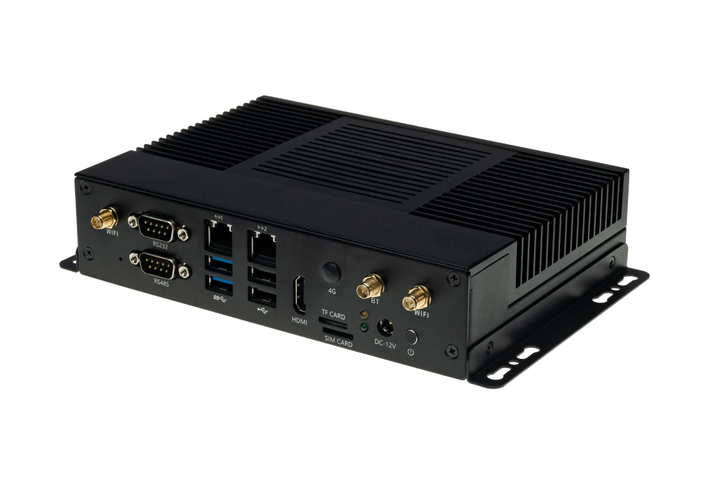
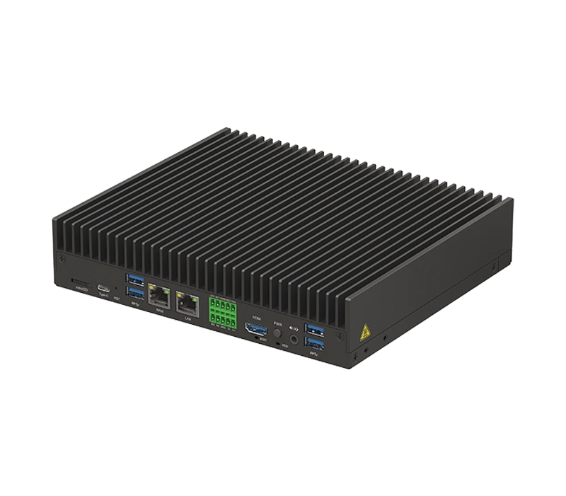
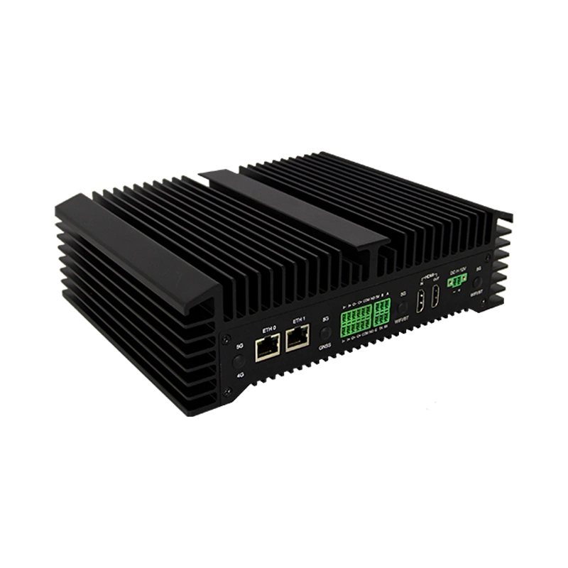

SE7是算能科技基于**BM1684X**SoC模式研发的微型AI服务器，是一款高性能、低功耗的边缘计算产品。

## 不同型号规格

| **规格项** | **SE7 32-EA4-23** | **SE7 32-BP1-11** | **SE7 32-BP1-12** | **SE7 32-EP1-21** |
|-|-|-|-|-|
| **外观图片** |||||
| **处理器** | BM1684X，8核ARM A53@2.3GHz | BM1684X，8核ARM A53@2.3GHz | BM1684X，8核ARM A53@2.3GHz | BM1684X，8核ARM A53@2.3GHz |
| **内存** | 16GB | 16GB | 16GB | 16GB |
| **存储** | 64GB eMMC 可扩展M.2 SATA3.0 SSD (2242) | 64GB eMMC（可扩展到128GB） 可扩展2.5寸/3.5寸SATA（外接硬盘仓） M.2 SATA3.0 SSD（2242/2260/2280） | 64GB eMMC（可扩展到128GB） 可扩展2.5寸/3.5寸SATA（外接硬盘仓） M.2 SATA3.0 SSD（2242/2260/2280） | 64GB eMMC 可扩展mSATA SSD、2.5寸SATA硬盘 |
| **视频解码** | 32x1080P@25fps 8x4K@25fps 1x8K@25fps | 32x1080P@25fps 8x4K@25fps 1x8K@25fps | 32x1080P@25fps 8x4K@25fps 1x8K@25fps | 32x1080P@25fps 8x4K@25fps 1x8K@25fps |
| **视频编码** | 12x1080P@25fps 3x4K@25fps 最大支持8K | 12x1080P@25fps 3x4K@25fps 最大支持8K | 12x1080P@25fps 3x4K@25fps 最大支持8K | 12x1080P@25fps 3x4K@25fps 最大支持8K |
| **工作温度** | -20℃~+60℃ | -20℃~+70℃ | -20℃~+60℃ | -40℃~+60℃ |
| **散热方式** | 带风扇主动散热 | 无风扇被动散热 | 无风扇被动散热 | 无风扇被动散热 |
| **网口** | 10/100/1000Mbps自适应×2 | 10/100/1000Mbps自适应×2 | 10/100/1000Mbps自适应×2 | 10/100/1000Mbps自适应×2 |
| **USB接口** | USB3.0×2、USB2.0×2 | USB3.0×2、USB2.0×2 | USB3.0×2、USB2.0×2 | USB3.0×2 |
| **存储卡** | MicroSD×1 | MicroSD×1 | MicroSD×1 | MicroSD×1 |
| **显示接口** | HDMI×1 | HDMI×1 | HDMI×1 | HDMI_OUT×1、HDMI_IN×1 |
| **串口** | RS-232×1、RS-485×1 | RS-232×1、RS-485×1 | RS-232×1、RS-485×1 | RS-232×1、RS-485×1 |
| **音频接口** | - | Audio Out×1 | Audio Out×1 | LINE_OUT×1、LINE_IN×1 |
| **其他接口** | TYPE C×1(调试串口) | TYPE C×1(调试串口)、自定义I/O×2、Sim×1 | TYPE C×1(调试串口)、自定义I/O×2、Sim×1 | GPIO×4、Type-C×1(调试串口) |
| **无线扩展** | WiFi/BT，可扩展4G (Mini PCIe) | 可扩展4G/5G (M.2接口) | 可扩展4G/5G (M.2接口) | 可扩展WiFi+BT、4G/5G (M.2接口) |
| **电源** | DC 12V/5A | DC 12V/5A | DC 12V/5A | DC 12V/5A |
| **防护等级** | IP40 | IP40 | IP40 | IP40 |
| **功耗** | ~30W | ~30W | ~30W | ~40W |
| **尺寸** | 210×130×44.5mm | 标品179×209×43mm 带硬盘仓179×349×43mm | 标品179×209×43mm 带硬盘仓179×349×43mm | 240×179.8×70mm |
| **重量** | 1.28kg | 标品3.05kg 带2.5寸硬盘3.2kg 带3.5寸硬盘3.75kg | 标品3.05kg 带2.5寸硬盘3.2kg 带3.5寸硬盘3.75kg | 3.3kg |

