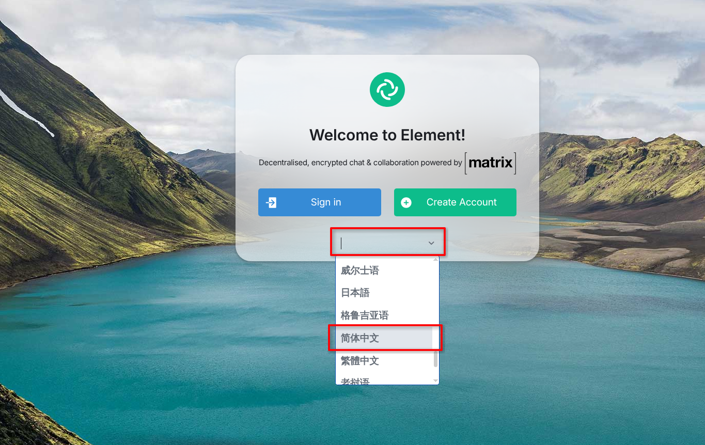
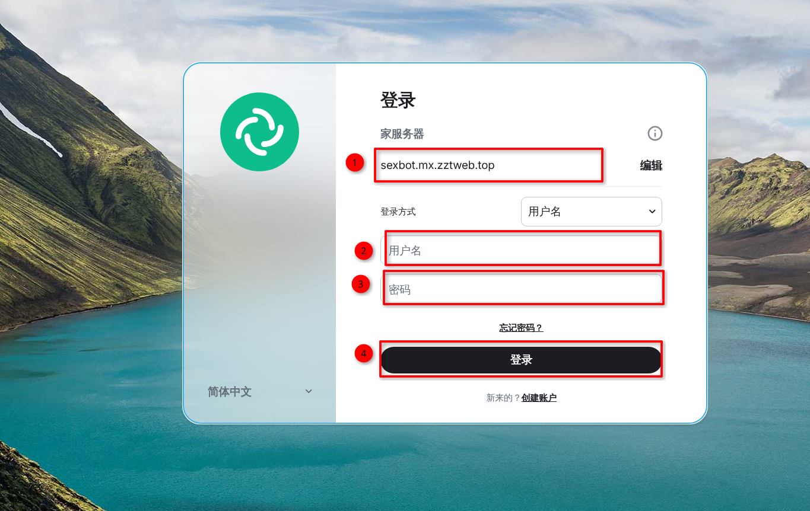
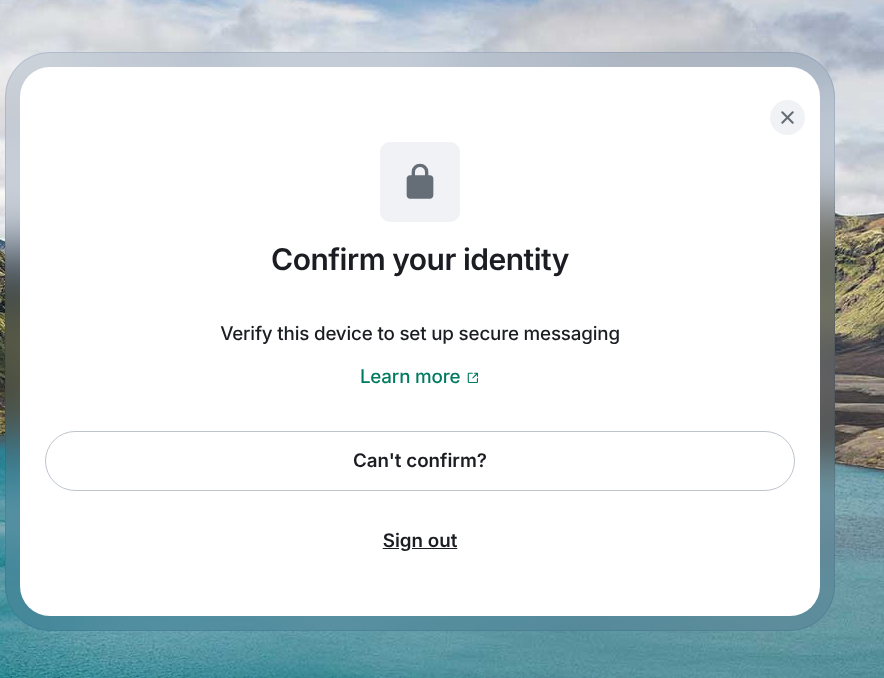
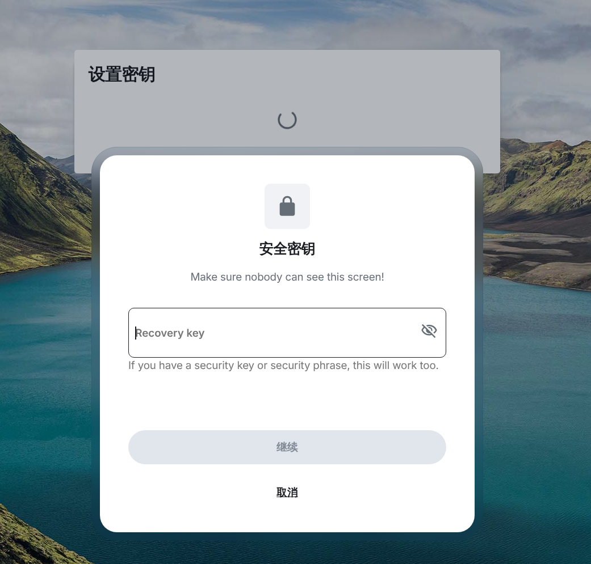
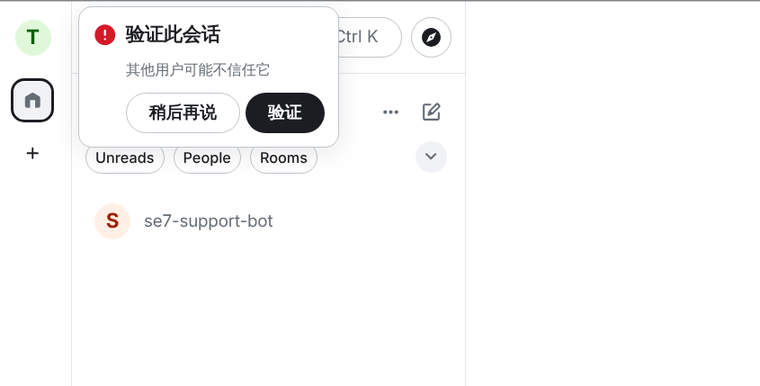
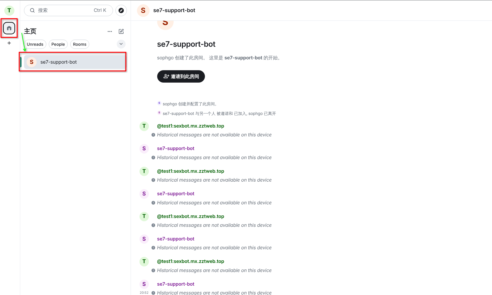

* 打开网页 [https://element.mx.zztweb.top/](https://element.mx.zztweb.top/) （第一次会比较慢）
* 选择合适的语言，然后点击**登录**
   
* **Homeserver**输入 **sexbot.mx.zztweb.top**（如果你的**element**是从[element.mx.zztweb.top/](https://element.mx.zztweb.top/)打开的，则默认就是**sexbot.mx.zztweb.top**）
   下方的用户名和密码处输入账户信息。然后点击登录
   
* 有时会询问是否验证你的设备，选择**不验证**、**跳过**、**确定不要验证**、**后续再处理**等。
   
* 有时会询问会话记录保存密钥，该密钥用于保存云端的会话记录不被读取，当切换登录用的设备、网站、软件时，需要重新输入密钥用于解密。此项可以忽略，直接点击取消即可
   
* 登录后，会询问验证会话相关的问题，选择**忽略**、**稍后再说**、**忽视**。
   
* 登陆后在该区域找到SE7-SUPPORT-BOT/SE9-SUPPORT-BOT等，按照设备类型选择你需要的会话
   

:::note
SEx技术支持BOT使用基于[Matrix协议](https://matrix.org/)和[AstrBot](https://github.com/AstrBotDevs/AstrBot)为用户提供支持
:::
