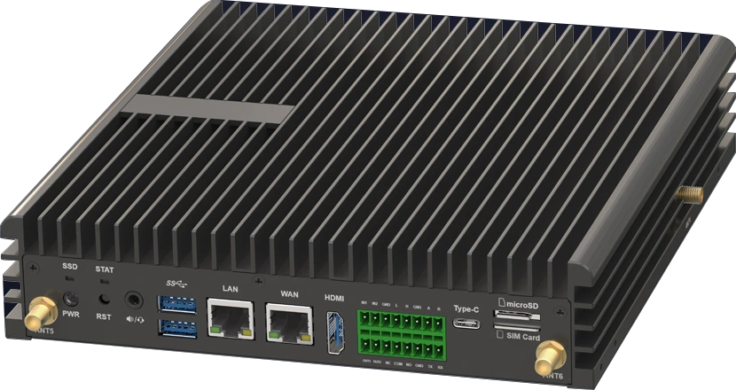
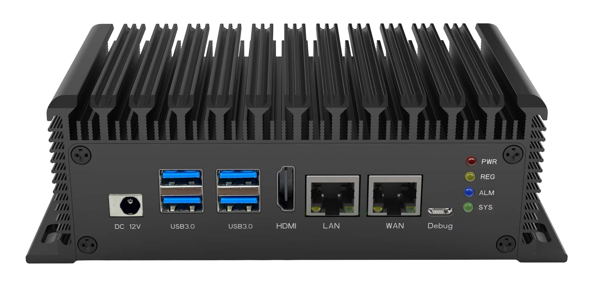

SE9是算能科技基于**BM1688/CV186AH**SoC模式研发的微型AI服务器，是一款高性能、低功耗的边缘计算产品。

## 不同型号规格

| **规格参数** | **SE9 16-BP1-11** | **SE9 16-BP1-18** | **SE9 8-BP1-11** | **SE9 8-BP1-17** | **SE9 8-EPC-A0** | **SE9 8-EPC-B0** | **SE9 16-EPC-20** | **SE9 16-EPC-A0** |
|---------|---------------|--------------|--------------|-------------|--------------|-------------|--------------|--------------|
| **外观图片** |  ||||||||
| **主芯片** | BM1688 | BM1688 | CV186AH | CV186AH | CV186AH | CV186AH | BM1688 | BM1688 |
| **主控处理器** | 8核 ARM CA53@1.6GHz | 8核 ARM CA53@1.6GHz | 6核 ARM CA53@1.6GHz | 6核 ARM CA53@1.6GHz | 6核 ARM CA53@1.6GHz | 6核 ARM CA53@1.6GHz | 8核 ARM CA53@1.6GHz | 8核 ARM CA53@1.6GHz |
| **内存** | 8GB (最大16GB) | 16GB | 4GB (最大16GB) | 8GB | 8GB | 4GB | 16GB | 8GB |
| **eMMC存储** | 32GB (最大128GB) | 64GB | 32GB (最大128GB) | 32GB | 32GB | 32GB | 64GB | 32GB |
| **视频解码能力** | H.264/H.265: 1080P@480fps 最大分辨率8192×8192 | H.264/H.265: 1080P@480fps 最大分辨率8192×8192 | H.264/H.265: 1080P@240fps 最大分辨率8192×8192 | H.264/H.265: 1080P@480fps 最大分辨率8192×8192 | H.264/H.265: 1080P@480fps 最大分辨率8192×8192 | H.264/H.265: 1080P@480fps 最大分辨率8192×8192 | H.264/H.265: 1080P@480fps 最大分辨率8192×8192 | H.264/H.265: 1080P@480fps 最大分辨率8192×8192 |
| **视频编码能力** | H.264/H.265: 1080P@300fps | H.264/H.265: 1080P@300fps | H.264/H.265: 1080P@240fps | H.264/H.265: 1080P@300fps | H.264/H.265: 1080P@300fps | H.264/H.265: 1080P@300fps | H.264/H.265: 1080P@300fps | H.264/H.265: 1080P@300fps |
| **典型功耗** | 15W | 15W | 12.5W | 12.5W | 12.5W | 12.5W | 15W | 15W |
| **工作温度** | -20℃ ~ +60℃ | -20℃ ~ +60℃ | -20℃ ~ +60℃ | -20℃ ~ +60℃ | -20℃ ~ +60℃ | -20℃ ~ +60℃ | -20℃ ~ +60℃ | -20℃ ~ +60℃ |
| **尺寸** | 200×220×46.8mm | 200×220×46.8mm | 200×220×46.8mm | 200×220×46.8mm | 165.8×83×53.5mm | 165.8×83×53.5mm | 165.8×83×53.5mm | 165.8×83×53.5mm |
| **接口特点** | ETH×2, USB3.0×2, HDMI2.0, Audio, CAN, RS-232, RS-485, TF, GPIO, SATA 3.0 | ETH×2, USB3.0×2, HDMI2.0, Audio, CAN, RS-232, RS-485, TF, GPIO, SATA 3.0 | ETH×2, USB3.0×2, HDMI2.0, Audio, CAN, RS-232, RS-485, TF, GPIO, SATA 3.0 | ETH×2, USB3.0×2, HDMI2.0, Audio, CAN, RS-232, RS-485, TF, GPIO, SATA 3.0 | ETH×2, USB3.0×2, USB2.0×2, HDMI2.0, Audio, TF | ETH×2, USB3.0×2, HDMI2.0, TF | ETH×2, USB3.0×2, USB2.0×2, HDMI2.0, Audio, TF | ETH×2, USB3.0×2, USB2.0×2, HDMI2.0, Audio, TF |
